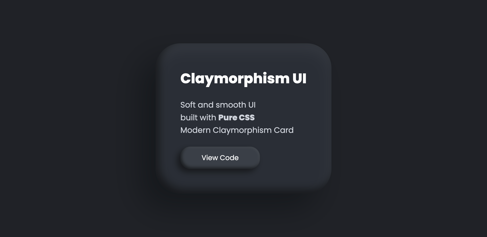

# 🌑 Dark Claymorphism Card UI

A modern **Dark Claymorphism Card UI** built using **pure HTML and CSS**. This project demonstrates soft UI design with subtle shadows, depth, and smooth styling — without using any JavaScript or frameworks.

---

## 🔥 Preview



Clean and minimal card design with:

* Soft clay-style surface
* Realistic depth using shadows
* Interactive button press effect

---

## ✨ Features

* 🌙 Dark theme claymorphism design
* 🎨 Soft shadows and realistic depth
* ⚡ Pure HTML + CSS (No JavaScript)
* 📱 Clean and minimal UI

---

## 🚀 Use Cases

This UI component can be used in:

* Dashboard cards
* Profile sections
* UI components
* Modern web interfaces

---

## 🛠 Tech Stack

* HTML5
* CSS3

---

## 📂 Project Structure

```
📁 claymorphism-ui
 ┣ 📄 index.html
 ┗ 📄 style.css
```

---

## 💻 How to Use

1. Clone the repository:

```
git clone https://github.com/DesignCodeWithAV/claymorphism-ui.git
```

2. Open `index.html` in your browser.

---

## 🎯 Learning Outcome

* Understanding claymorphism design
* Working with box-shadow for depth
* Creating modern UI using only CSS

---

## 👨‍💻 Author

**Ajay Vishwakarma**
Frontend Developer | UI Designer

---

## ⭐ Support

If you like this project:

* ⭐ Star the repo
* 🔁 Share with others
* 💬 Follow for more CSS UI designs

---

## 📢 Connect

YouTube: Design & Code with AV
GitHub: [https://github.com/DesignCodeWithAV](https://github.com/DesignCodeWithAV)

---

💡 *More UI designs and CSS tricks coming soon!* 🚀
